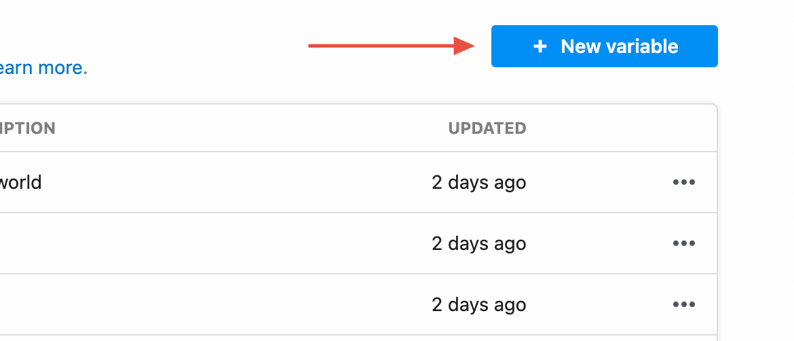
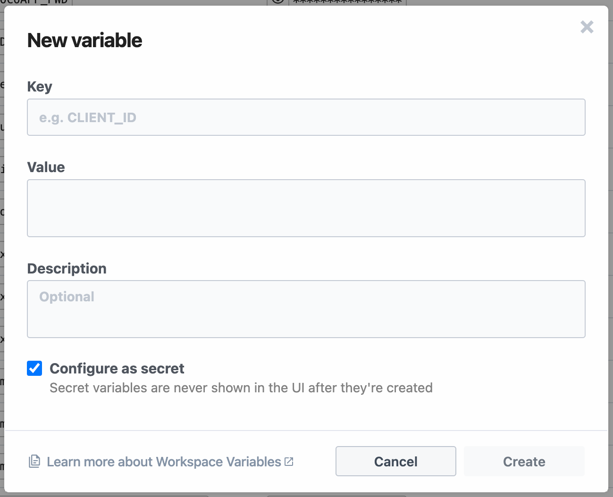
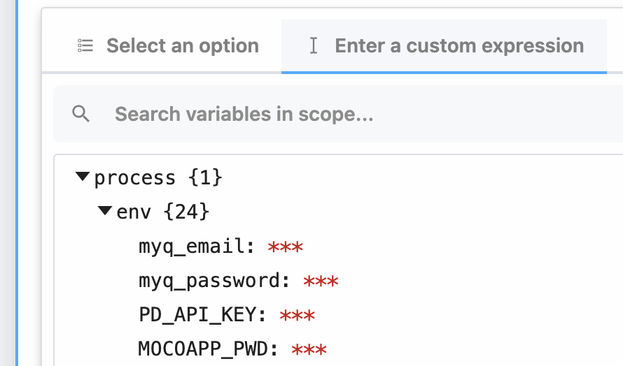

# Environment Variables

Environment variables enable you to separate secrets and other static configuration data from your code.

You shouldn't include API keys or other sensitive data directly in your workflow's code. By referencing the value of an environment variable instead, your workflow includes a reference to that variable — `process.env.API_KEY` — instead of the API key itself.

You can reference env vars and secrets in [workflow code](/code/) or in the object explorer when passing data to steps, and you can define them either globally for the entire workspace, or scope them to individual projects.

| Scope | Description |
| -- | -- |
| **Workspace** | All environment variables are available to all workflows within the workspace. All workspace members can manage workspace-wide variables [in the UI](https://pipedream.com/settings/env-vars). |
| **Project** | Environment variables defined within a project are only accessible to the workflows within that project. Only workspace members who have [access to the project](/projects/#permissions) can manage project variables. |

<br />

[[toc]]

## Creating and updating environment variables

- To manage **global** environment variables for the workspace, navigate to **Settings**, then click **Environment Variables**: [https://pipedream.com/settings/env-vars](https://pipedream.com/settings/env-vars)
- To manage environment variables within a project, open the project, then click **Variables** from the project nav on the left


Click **New Variable** to add a new environment variable or secret:


**Configure the required fields**:


| Input field | Description |
| :-- | :-- |
| **Key** | Name of the variable — for example, `CLIENT_ID` |
| **Value** | The value, which can contain any string with a max limit of 64KB |
| **Description** | Optionally add a description of the variable. This is only visible in the UI, and is not accessible within a workflow. |
| **Secret** | New variables default to **secret**. If configured as a secret, the value is never exposed in the UI and cannot be modified. |

To edit an environment variable, click the **Edit** button from the three dots to the right of a specific variable.


- Updates to environment variables will be made available to your workflows as soon as the save operation is complete — typically a few seconds after you click **Save**.
- If you update the value of an environment variable in the UI, your workflow should automatically use that new value where it's referenced.
- If you delete a variable in the UI, any deployed workflows that reference it will return `undefined`.

## Referencing environment variables in code

You can reference the value of any environment variable using the object [`process.env`](https://nodejs.org/dist/latest-v10.x/docs/api/process.html#process_process_env). This object contains environment variables as key-value pairs.

For example, let's say you have an environment variable named `API_KEY`. You can reference its value in Node.js using `process.env.API_KEY`:

```javascript
const url = `http://yourapi.com/endpoint/?api_key=${process.env.API_KEY}`;
```

Reference the same environment variable in Python:

```python
import os
print(os.environ[API_KEY])
```

Variable names are case-sensitive. Use the key name you defined when referencing your variable in `process.env`.

Referencing an environment variable that doesn't exist returns the value `undefined` in Node.js. For example, if you try to reference `process.env.API_KEY` without first defining the `API_KEY` environment variable ni the UI, it will return the value `undefined`.

::: warning
Logging the value of any environment variables — for example, using `console.log` — will include that value in the logs associated with the cell. Please keep this in mind and take care not to print the values of sensitive secrets.
:::

::: tip
`process.env` will always return `undefined` when used outside of the `defineComponent` export.
:::

## Referencing environment variables in actions

[Actions](/components#actions) are pre-built code steps that let you provide input in a form, selecting the correct params to send to the action.

You can reference the value of environment variables using <code v-pre>{{process.env.YOUR_ENV_VAR}}</code>. You'll see a list of your environment variables in the object explorer when selecting a variable to pass to a step:



## Frequently Asked Questions

### What if I define the same variable key in my workspace env vars and project env vars?

The project-scoped variable will take priority if the same variable key exists at both the workspace and project level. If a workflow _outside_ of the relevant project references that variable, it'll use the value of the environment variable defined for the workspace.

### What happens if I share a workflow that references an environment variable?
If you [share a workflow](/workflows/sharing/) that references an environment variable, **only the reference is included, and not the actual value**.

## Limits
- Currently, **environment variables are only exposed in Pipedream workflows, [not event sources](https://github.com/PipedreamHQ/pipedream/issues/583)**.
- The value of any environment variable may be no longer than `64KB`.
- The names of environment variables must start with a letter or underscore.
- Pipedream reserves environment variables that start with `PIPEDREAM_` for internal use. You cannot create an environment variable that begins with that prefix.

<Footer />
